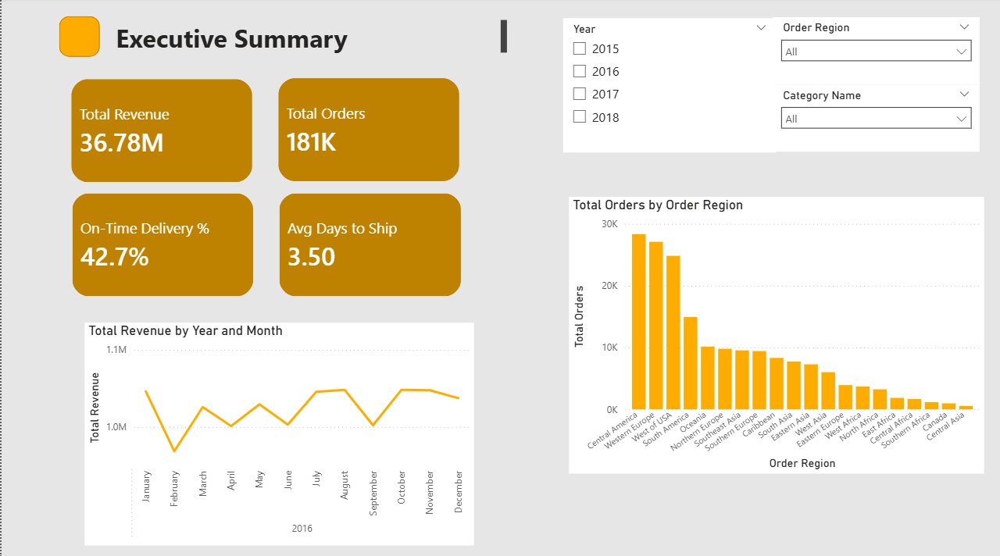
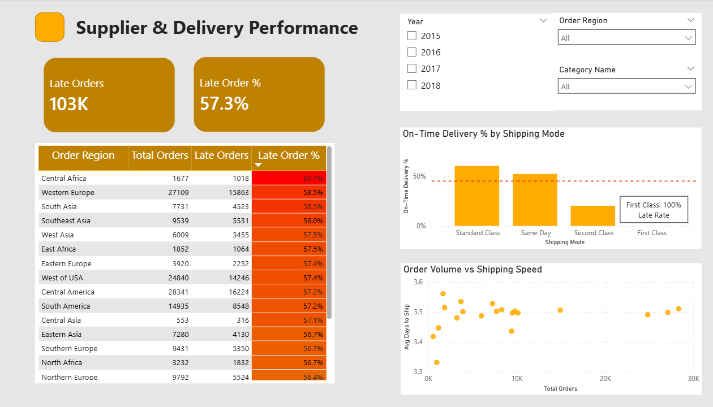
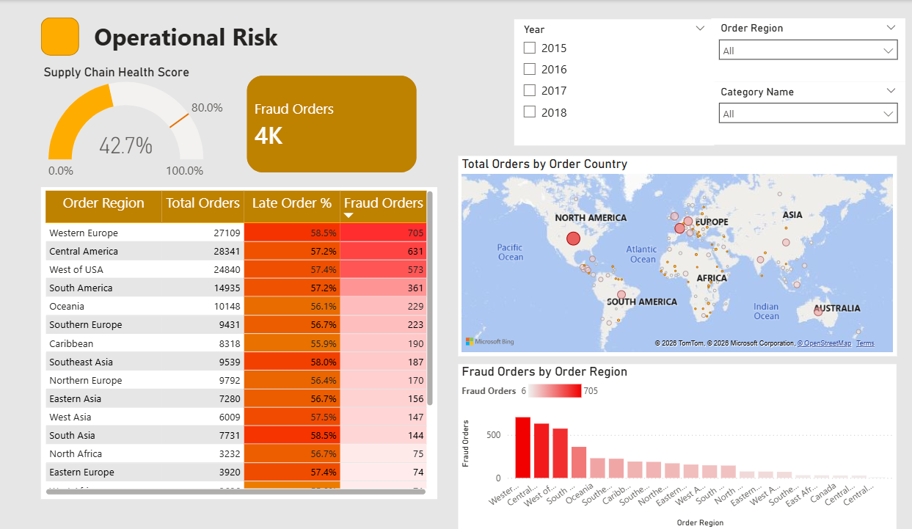

# Supply Chain Analytics Dashboard

An end-to-end data engineering and analytics project built with **Python**, **Power Query**, and **Power BI Desktop**, using the [DataCo Smart Supply Chain](https://www.kaggle.com/datasets/shashwatwork/dataco-smart-supply-chain-for-big-data-analysis) dataset (180,000+ order records). The project follows a **medallion architecture** (raw → cleaned) that mirrors a Microsoft Fabric Lakehouse workflow, transforming raw supply chain data into a star schema and delivering insights through a multi-page Power BI dashboard.

---

## Architecture

```
Kaggle API (kagglehub)
        ↓
  data/raw/                ←  Bronze layer — unmodified source CSV
        ↓
  Jupyter Notebook         ←  Python/Pandas — cleaning, enrichment, dimensional modeling
        ↓
  data/cleaned/            ←  Gold layer — star schema CSVs (1 fact + 4 dimension tables)
        ↓
  Power Query              ←  Data type validation and formatting
        ↓
  Power BI Desktop         ←  Star schema relationships, DAX measures, dashboard
```

The local folder structure is designed to mirror a real Fabric Lakehouse, with a raw layer for source data and a cleaned layer for transformed output. This approach keeps the pipeline reproducible and separates concerns between ingestion, transformation, and visualization.

---

## Folder Structure

```
supply-chain-analytics/
├── data/
│   ├── raw/                        # Bronze layer — original downloaded CSV
│   │   └── DataCoSupplyChain.csv
│   └── cleaned/                    # Gold layer — star schema output
│       ├── fact_orders.csv
│       ├── dim_customer.csv
│       ├── dim_product.csv
│       ├── dim_date.csv
│       └── dim_region.csv
├── notebooks/
│   ├── data-ingest.ipynb           # Download from Kaggle, initial profiling, save to raw/
│   └── data-transform.ipynb        # Clean, enrich, model into star schema, export to cleaned/
├── powerbi/
│   └── supply_chain_dashboard.pbix
├── screenshots/
│   ├── executive-summary.png
│   ├── supplier-delivery.png
│   └── operational-risk.png
└── README.md
```

---

## Data Pipeline

### 1. Ingestion (`data-ingest.ipynb`)

- Downloads the DataCo dataset directly from Kaggle using `kagglehub`
- Profiles the dataset structure: column names, data types, null counts
- Persists the unmodified CSV to `data/raw/` as a reproducible source of truth

### 2. Transformation (`data-transform.ipynb`)

- **Null handling:** Drops rows missing critical identifiers (`Order Id`, `Customer Id`, `Order Item Quantity`)
- **Type conversion:** Casts order and shipping date columns from string to datetime
- **Feature engineering:** Creates an `Is Late` binary flag comparing actual vs. scheduled shipping days
- **Dimensional modeling:** Splits the flat dataset into a star schema:

```
                    dim_customer
                        │
                        │ Customer Id
                        │
dim_date ── Date ── fact_orders ── Product Card Id ── dim_product
                        │
                        │ Order Region
                        │
                    dim_region
```

Each dimension table is deduplicated to eliminate redundant descriptive data. The fact table retains only foreign keys and numeric measures (quantity, price, sales, profit ratio, late flag).

### 3. Power Query and Data Modeling

- **Power Query** validates data types and confirms transformations carried over correctly from the notebook stage
- **Star schema relationships** are defined in Power BI Desktop between the fact table and each dimension on their respective key columns
- **DAX measures** are written for dashboard KPIs rather than relying on default aggregations

Key DAX measures:

```DAX
Total Revenue = SUMX(Fact_Orders, Fact_Orders[Order Item Quantity] * Fact_Orders[Order Item Product Price])

On-Time Delivery % =
DIVIDE(
    COUNTROWS(FILTER(Fact_Orders, Fact_Orders[Is Late] = 0)),
    COUNTROWS(Fact_Orders)
) * 100

Late Orders = COUNTROWS(FILTER(Fact_Orders, Fact_Orders[Is Late] = 1))

Late Order % = DIVIDE([Late Orders], COUNTROWS(Fact_Orders)) * 100

Avg Days to Ship = AVERAGE(Fact_Orders[Days for shipping (real)])
```

---

## Dashboard

The dataset is synthetic, so the specific numbers are not meaningful — the dashboard is built to demonstrate layout, interactivity, and the ability to surface actionable KPIs from a star schema model.

### Page 1 — Executive Summary


KPI cards, revenue trend over time, order volume by region. Slicers for year, region, and product category enable cross-filtering across all visuals.

### Page 2 — Supplier and Delivery Performance


Late order breakdown by region with conditional formatting, on-time delivery rate by shipping mode, and a scatter plot mapping order volume against shipping speed.

### Page 3 — Operational Risk


Supply chain health gauge, fraud order distribution by region with conditional formatting, and a geographic map visual showing order concentration by country.

---

## Tech Stack

| Tool | Purpose |
|---|---|
| Python (Pandas) | Data cleaning, feature engineering, dimensional modeling |
| Jupyter Notebook | Pipeline orchestration for ingestion and transformation |
| kagglehub | Dataset download via Kaggle API |
| Power Query | Data type validation and formatting in Power BI |
| Power BI Desktop | Star schema relationships, DAX measures, dashboard development |
| DAX | Calculated KPI measures |

---

## Next Steps

- **Inventory and Product Analysis page** — Top products by order volume, revenue by category treemap, and drill-through to detailed product-level order history
- **Migrate to Microsoft Fabric** — Move the pipeline into a Fabric Lakehouse with Notebooks for transformation and a native semantic model connection to Power BI
- **Row-level security** — Implement RLS to restrict dashboard views by region or department

---

## How to Run

1. Clone the repo
2. Install dependencies: `pip install kagglehub pandas python-dotenv`
3. Add your Kaggle credentials to a `.env` file (`KAGGLE_USERNAME` and `KAGGLE_KEY`)
4. Run `notebooks/data-ingest.ipynb` to download the dataset
5. Run `notebooks/data-transform.ipynb` to generate the star schema CSVs
6. Open `powerbi/supply_chain_dashboard.pbix` in Power BI Desktop and refresh the data source paths
